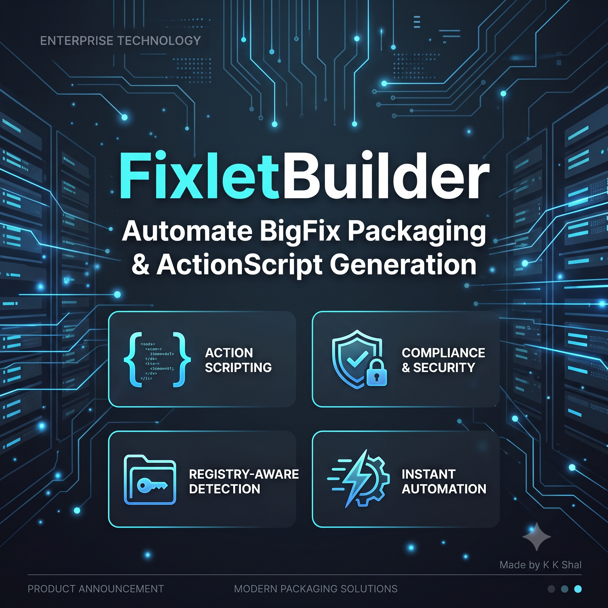

# FixletBuilder



A production-grade GUI & CLI tool for generating HCL BigFix `.bes` fixlet files with registry-aware detection, prefetch downloads, and action script generation.

**Made by K K Shal**

---

## Features

### Core
- **GUI Application** — WPF-based desktop app with real-time XML preview
- **CLI Interface** — Command-line tool for scripting and automation
- **CSV/Excel Import** — Batch generate fixlets from spreadsheets
- **Installed App Scanner** — Scan machine and auto-generate fixlets from installed software

### Action Script Generation
- **71 BigFix ActionScript commands** integrated with searchable reference
- **Prefetch downloads** with SHA1/SHA256 hash verification
- **Pre-install actions** — Kill processes, stop services before install
- **Registry operations** — regset, regset64, regdelete, regkeydelete
- **Flow control** — if/elseif/else, continue if, pause while, exit
- **File operations** — copy, move, delete, folder create/delete, createfile, appendfile
- **Execution** — wait, waithidden, run, dos, script, override with custom options
- **Client commands** — restart, shutdown, settings, action lock/unlock

### Detection & Relevance
- **Registry key/value detection** using `native registry` syntax
- **Version comparison** with `as string as version` inspectors
- **Fallback chain** — file path → registry key+value → registry key only → folder guess
- **Automatic relevance generation** for install, upgrade, and uninstall fixlets

### Metadata & Hashes
- **Auto-fetch from winget** — App name, version, URL, silent args, install path
- **Hash computation** — Download installer and compute SHA1, SHA256, file size
- **Registry detection** — Auto-find registry key from installed apps
- **Version monitoring** — Track installed app versions and detect updates

### Security
- **URL validation** — Blocks private IPs, localhost, cloud metadata endpoints (SSRF prevention)
- **Input sanitization** — Proper escaping for winget CLI arguments
- **No telemetry** — No external data connections or tracking

---

## Requirements

- Windows 10/11 (x64)
- .NET 8.0 SDK
- winget (optional, for auto-fetch and version monitoring)

---

## Build & Run

```bash
# Build
dotnet build FixletBuilder.csproj

# Run (GUI)
dotnet run --project FixletBuilder.csproj

# Run (CLI)
dotnet run --project FixletBuilder.csproj -- [options]
```

---

## CLI Usage

```bash
# Create a single fixlet
FixletBuilder.exe create --type install --name "7-Zip" --version "24.09" --url "https://..."

# Import from CSV
FixletBuilder.exe import --csv packages.csv --output ./fixlets

# Scan installed apps
FixletBuilder.exe scan --output ./fixlets

# Check for updates
FixletBuilder.exe check-updates --track

# Auto-fetch from winget
FixletBuilder.exe create --name "Chrome" --auto-fetch
```

---

## CSV Format

| name | version | url | silent_args | type | install_path | uninstall_string | sha1 | sha256 | filesize | registrykey | registryvaluename | registryvalue | processToKill | serviceToStop |
|------|---------|-----|-------------|------|--------------|------------------|------|--------|----------|-------------|-------------------|---------------|---------------|---------------|
| 7-Zip | 24.09 | https://... | /S | install | C:\Program Files\7-Zip | | abc123 | def456 | 1748480 | HKLM\SOFTWARE\7-Zip | DisplayVersion | 24.09 | | |

---

## Action Script Templates

### Install
```
prefetch {AppName} sha1:{Sha1} size:{FileSize} "{Url}" sha256:{Sha256}
waithidden powershell -Command "Stop-Process -Name '{Process}' -Force -ErrorAction SilentlyContinue"
waithidden sc stop "{Service}"
waithidden msiexec /i "{AppName}" /q
action requires restart
```

### Uninstall
```
waithidden {UninstallString}
action requires restart
```

### Upgrade
```
prefetch {AppName} sha1:{Sha1} size:{FileSize} "{Url}" sha256:{Sha256}
waithidden msiexec /i "{AppName}" /q
action requires restart
```

---

## Relevance Detection

Uses `native registry` for proper 32/64-bit detection:

```
exists key "HKLM\SOFTWARE\..." of native registry
exists value "DisplayVersion" whose (it as string as version >= "1.0" as version) of key "HKLM\SOFTWARE\..." of native registry
```

---

## Quick Insert Panel

20 one-click snippet buttons in the Action Script tab:

| Pre-Install | Post-Install | Flow Control | Registry |
|-------------|--------------|--------------|----------|
| Kill Process | Restart (delay) | Continue If | Set Registry |
| Stop Service | Shutdown (delay) | Pause While | Set Reg 64 |
| Delete File | Action Restart | | Delete Reg Value |
| Delete Folder | Client Restart | | Delete Reg Key |
| Copy File | Force Refresh | | |
| Move File | | | |
| Create Folder | | | |
| Create Config | | | |
| Append File | | | |

---

## Command Reference

Press **F1** or click the **Command Reference** tab to access the searchable reference for all 71 BigFix ActionScript commands with syntax, descriptions, examples, and platform support.

---

## Keyboard Shortcuts

| Shortcut | Action |
|----------|--------|
| Ctrl+S | Save fixlet |
| Ctrl+N | New fixlet |
| Ctrl+Shift+O | Import CSV/Excel |
| F1 | Open Command Reference |

---

## Project Structure

```
FixletBuilder/
├── MainWindow.xaml/.cs      — Main GUI window
├── ImportWindow.xaml/.cs    — CSV/Excel import dialog
├── ScanWindow.xaml/.cs      — Installed app scanner
├── App.xaml/.cs             — Application entry point
├── Core/
│   ├── ActionScriptCommands.cs — 71 command reference + snippets
│   ├── RelevanceBuilder.cs     — Registry-aware relevance generation
│   ├── FixletTemplates.cs      — Action script templates
│   ├── FixletModel.cs          — Fixlet data model
│   ├── FixletFactory.cs        — Build fixlets from CSV/manual input
│   ├── FixletWriter.cs         — Generate BES XML output
│   ├── DownloadService.cs      — Download files + compute hashes
│   ├── WingetIntegration.cs    — Winget CLI integration
│   ├── InstalledAppsScanner.cs — Scan installed applications
│   ├── AppVersionMonitor.cs    — Track app versions for updates
│   ├── BigFixConsoleClient.cs  — BigFix REST API client
│   ├── CliRunner.cs            — CLI argument parser
│   ├── AppSettings.cs          — JSON config persistence
│   └── ...
├── Resources/
│   └── app.ico                 — Application icon
└── appsettings.json            — Configuration file
```

---

## Configuration

Edit `appsettings.json`:

```json
{
  "BaseUrl": "https://bigfix.example.com:52311",
  "Username": "admin",
  "Password": "",
  "SkipCertificateValidation": false,
  "TimeoutSeconds": 30
}
```

---

## License

MIT License — Copyright (c) 2026 K K Shal
